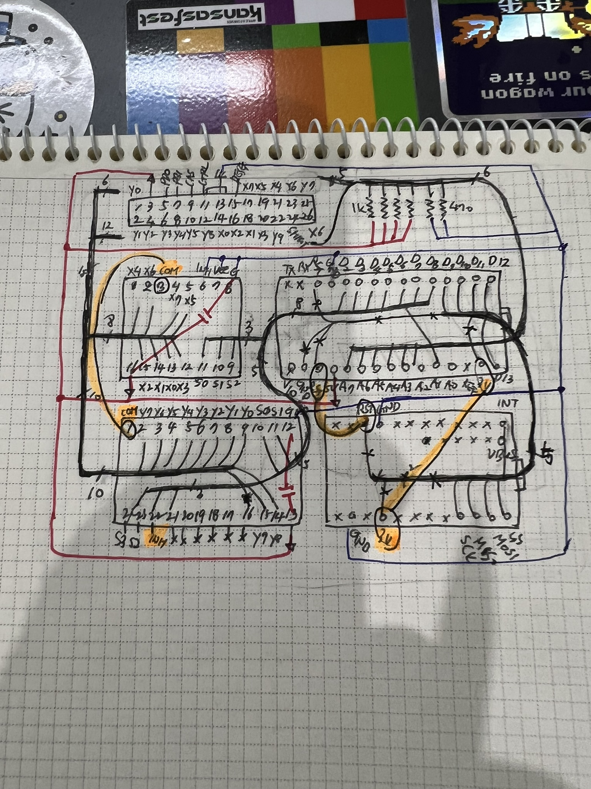
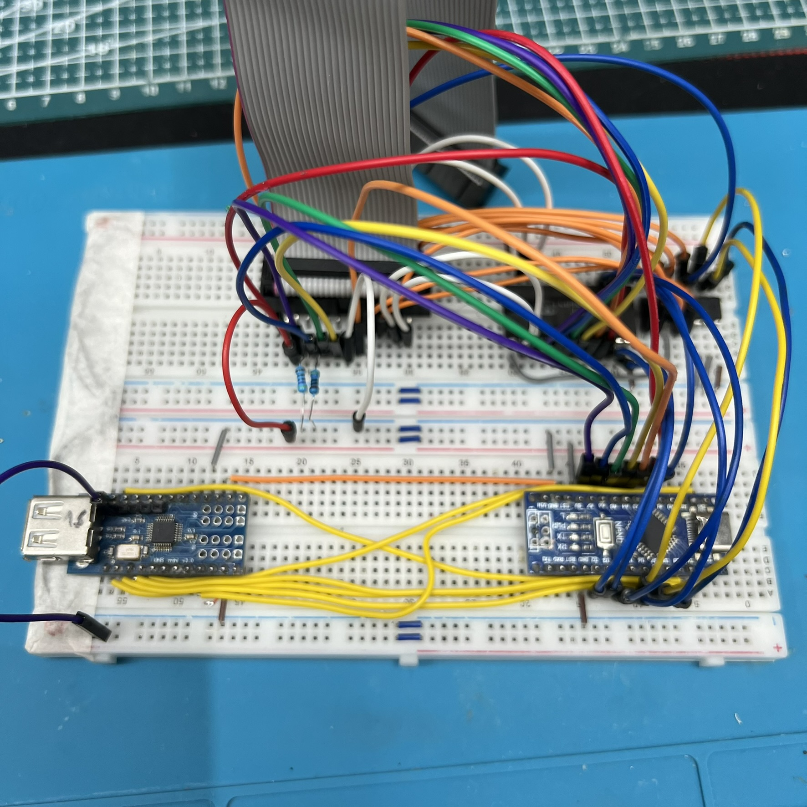
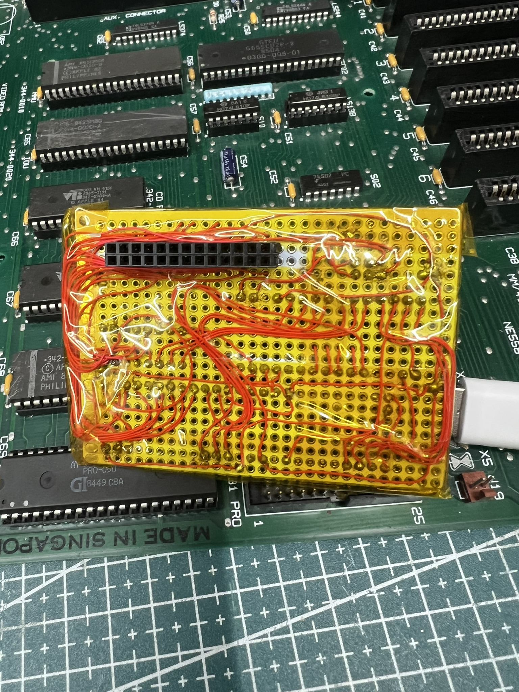
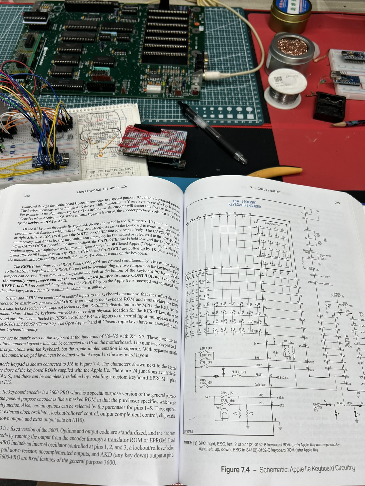

# a2e-usb-kbd

Apple //e daughter board for USB HID Keyboard

## Hardware

### Bill of Materials

- Arduino Nano
- USB Host Shield for Arduino
- CD4051
- CD4067
- 2 x 470 ohm resistors
- 13x2 IDC female connector or cable
- and USB HID Keyboard

## Firmware

### Build

1. Install the Arduino IDE from https://www.arduino.cc/en/software
2. Install Arduino:AVR Board
3. Install USB Host Shield Library 2.0
4. Compile & Upload
5. Enjoy!

## Making

- 
- 
- 
- 
- 
- [in action](https://youtube.com/shorts/Eiom-mUk_yY)

## References

- [Understanding Apple //e](https://www.callapple.org/books-3/understanding-the-apple-iie/)
- [RetroConnector](https://github.com/option8/RetroConnector)

---
May the **SOURCE** be with you...
